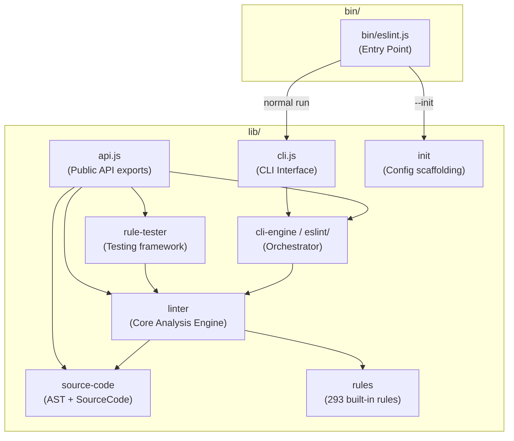
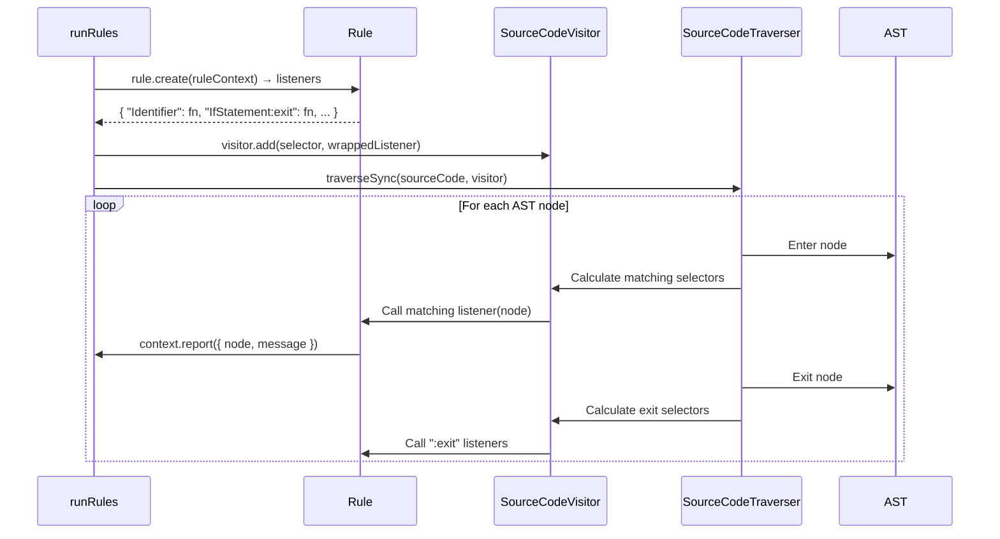

# How ESLint Works Under the Hood — A Deep Dive

This document provides a detailed, code-level explanation of how ESLint works internally, based on the architecture diagram you provided and the actual source code in `node_modules/eslint`.

---

## Architecture Overview (Your Diagram Explained)

Your diagram shows the layered architecture of ESLint. Here is how each component relates to the others:



---

## The Complete Execution Flow

### Phase 1: Entry Point — `bin/eslint.js`

When you run `npx eslint .` or `eslint myfile.js`, Node.js executes [bin/eslint.js](file:///Users/lephantriduc/UET/ki_6/SQA/eslint-demo/node_modules/eslint/bin/eslint.js).

**What it does:**

1. **Enables V8 compile cache** for faster startup (line 15):
   ```js
   mod.enableCompileCache?.();
   ```

2. **Handles special flags** before anything else:
   - `--init` → spawns `npm init @eslint/config@latest` to scaffold config (lines 143-156)
   - `--mcp` → starts the MCP server (lines 159-171)
   - `--debug` → enables debug logging (lines 18-20)

3. **Delegates to `cli.js`** for normal linting (lines 174-178):
   ```js
   const cli = require("../lib/cli");
   const exitCode = await cli.execute(
       process.argv,
       process.argv.includes("--stdin") ? await readStdin() : void 0,
   );
   ```

4. **Error handling** with `onFatalError` wraps uncaught exceptions and prints a user-friendly error with the ESLint version.

---

### Phase 2: CLI Processing — `lib/cli.js`

[cli.js](file:///Users/lephantriduc/UET/ki_6/SQA/eslint-demo/node_modules/eslint/lib/cli.js) is the **command-line interface layer**. It translates CLI arguments into API calls.

**Key steps in `cli.execute()`** (lines 199-519):

1. **Parse CLI arguments** using the options module:
   ```js
   const CLIOptions = createCLIOptions();
   options = CLIOptions.parse(args);
   ```

2. **Handle info flags** (`--help`, `--version`, `--env-info`, `--print-config`, `--inspect-config`) — these short-circuit and return immediately.

3. **Validate flag combinations** — ensures mutually exclusive flags like `--fix` and `--fix-dry-run` aren't used together (lines 289-367).

4. **Create the ESLint engine** (lines 372-378):
   ```js
   if (options.concurrency !== "off") {
       const optionsURL = createOptionsModule(options);
       engine = await ESLint.fromOptionsModule(optionsURL);
   } else {
       const eslintOptions = await translateOptions(options);
       engine = new ESLint(eslintOptions);
   }
   ```

5. **Run linting** — either `engine.lintText()` for stdin or `engine.lintFiles()` for file paths (lines 381-387).

6. **Apply fixes** if `--fix` is enabled by writing fixed content back to files (lines 389-392):
   ```js
   if (options.fix) {
       await ESLint.outputFixes(results);
   }
   ```

7. **Format and print results** using the specified formatter (default: stylish) (lines 478-484).

8. **Determine exit code**: `0` = no errors, `1` = lint errors found, `2` = fatal/config error.

---

### Phase 3: The ESLint Class — `lib/eslint/eslint.js`

[ESLint](file:///Users/lephantriduc/UET/ki_6/SQA/eslint-demo/node_modules/eslint/lib/eslint/eslint.js) is the **primary Node.js API** (the modern replacement for the old `CLIEngine`). It orchestrates configuration loading, file discovery, caching, and delegates the actual linting to the `Linter`.

**Constructor** (lines 693-757):
```js
constructor(options = {}) {
    const processedOptions = processOptions(options);
    const linter = createLinter(processedOptions, warningService);
    const lintResultCache = createLintResultCache(processedOptions, cacheFilePath);
    this.#configLoader = createConfigLoader(processedOptions, defaultConfigs, linter, warningService);
    // ... stores all in privateMembers WeakMap
}
```

**`lintFiles()` workflow** (simplified):

1. **Find files** using glob patterns and the config's `files`/`ignores` patterns
2. **Resolve configuration** for each file via `configLoader.getCachedConfigArrayForFile()`
3. **Check cache** — if results are cached and the file hasn't changed, reuse them
4. **Choose single-thread or multi-thread** based on concurrency settings:
   - **Single-thread** (`lintFilesWithoutMultithreading`, lines 582-631): reads files in parallel with `Promise.all`, then lints each
   - **Multi-thread** (`lintFilesWithMultithreading`, lines 533-574): uses Node.js `Worker` threads to distribute linting across CPU cores
5. **Store results** in the lint result cache for subsequent runs

> [!IMPORTANT]
> The ESLint class **does NOT parse or lint code itself**. It delegates all actual analysis to the `Linter` class. ESLint is purely an orchestration layer.

---

### Phase 4: The Linter — `lib/linter/linter.js` (The Heart of ESLint)

[Linter](file:///Users/lephantriduc/UET/ki_6/SQA/eslint-demo/node_modules/eslint/lib/linter/linter.js) is where **all the real magic happens**. This 1,631-line file contains the core analysis engine.

#### 4a. `verify()` — The Main Entry Point (line 829)

```js
verify(textOrSourceCode, config, filenameOrOptions) {
    // 1. Normalize the config into a FlatConfigArray
    // 2. Call _verifyWithFlatConfigArray()
    // 3. Separate suppressed messages from normal messages
}
```

#### 4b. `_verifyWithFlatConfigArray()` — Config Resolution (line 1365)

```js
_verifyWithFlatConfigArray(textOrSourceCode, configArray, options) {
    const config = configArray.getConfig(filename);  // get merged config for this file
    
    if (config.processor) {
        // Route to processor pipeline (for .vue, .md files, etc.)
        return this._verifyWithFlatConfigArrayAndProcessor(...);
    }
    
    return this._verifyWithFlatConfigArrayAndWithoutProcessors(...);
}
```

#### 4c. `#flatVerifyWithoutProcessors()` — The Core Pipeline (line 979)

This is the **most critical method**. Here is exactly what it does, step by step:

**Step 1 — Parse the source code** (lines 992-1003):
```js
const parserService = new ParserService();
const parseResult = parserService.parseSync(file, config);
// parseResult.sourceCode now contains the AST
slots.lastSourceCode = parseResult.sourceCode;
```
The parser (default: [espree](https://github.com/eslint/espree)) converts the raw JavaScript text into an **Abstract Syntax Tree (AST)** — a tree data structure representing the code's structure.

**Step 2 — Apply language options** (line 1044):
```js
sourceCode.applyLanguageOptions?.(languageOptions);
```
This injects global variables (like `window`, `document`, `console`) into the scope based on the configured `ecmaVersion`, `sourceType`, and `globals`.

**Step 3 — Process inline configuration** (lines 1056-1243):
ESLint parses comments like `/* eslint no-console: "error" */` and `/* eslint-disable */` and merges them with the file config. It validates rule options and detects redundant inline configs.

**Step 4 — Extract disable directives** (lines 1245-1253):
```js
const commentDirectives = getDirectiveCommentsForFlatConfig(
    sourceCode,
    ruleId => config.getRuleDefinition(ruleId),
    config.language,
    report,
);
```
This parses `eslint-disable`, `eslint-enable`, `eslint-disable-line`, and `eslint-disable-next-line` comments into structured directive objects.

**Step 5 — Merge rules** (lines 1255-1258):
```js
const configuredRules = Object.assign({}, config.rules, mergedInlineConfig.rules);
```

**Step 6 — Finalize source code** (line 1261):
```js
sourceCode.finalize?.();
```

**Step 7 — Run all rules** (lines 1264-1279) — this is where `runRules()` is called:
```js
runRules(
    sourceCode, configuredRules, ruleMapper,
    language, languageOptions, settings,
    filename, false, cwd, physicalFilename,
    ruleFilter, stats, slots, report,
);
```

**Step 8 — Apply disable directives** (lines 1300-1314):
After all rules have reported problems, the `applyDisableDirectives` function filters out any messages that fall within `eslint-disable` ranges and flags unused disable directives.

---

### Phase 5: Rule Execution — `runRules()` (The Visitor Pattern)

The [runRules()](file:///Users/lephantriduc/UET/ki_6/SQA/eslint-demo/node_modules/eslint/lib/linter/linter.js#L523-L689) function at line 523 is where **rules are instantiated and the AST is traversed**. This is the core of ESLint's linting mechanism.



**Detailed breakdown:**

#### 5a. Initialize Rules (lines 557-682)

For each configured rule:

1. **Skip disabled rules** (severity `0`):
   ```js
   if (severity === 0) return;
   ```

2. **Look up the rule definition** from the rule mapper:
   ```js
   const rule = ruleMapper(ruleId);
   ```

3. **Create a rule context** — a sandboxed object that rules use to interact with ESLint:
   ```js
   const ruleContext = fileContext.extend({
       id: ruleId,
       options: getRuleOptions(configuredRules[ruleId], rule.meta?.defaultOptions),
       report(...args) {
           // Creates a lint message and validates fix/suggestion metadata
           const problem = report.addRuleMessage(ruleId, severity, ...args);
       },
   });
   ```

4. **Call `rule.create(ruleContext)`** to get the rule's **listener map** (lines 485-502):
   ```js
   function createRuleListeners(rule, ruleContext) {
       return rule.create(ruleContext);
       // Returns something like:
       // { "VariableDeclaration": fn, "Identifier": fn, "Program:exit": fn }
   }
   ```

5. **Register each listener** with the `SourceCodeVisitor` (lines 674-681):
   ```js
   Object.keys(ruleListeners).forEach(selector => {
       visitor.add(selector, addRuleErrorHandler(ruleListener));
   });
   ```

#### 5b. Traverse the AST (line 684-686)

```js
const traverser = SourceCodeTraverser.getInstance(language);
traverser.traverseSync(sourceCode, visitor, { steps });
```

The [SourceCodeTraverser](file:///Users/lephantriduc/UET/ki_6/SQA/eslint-demo/node_modules/eslint/lib/linter/source-code-traverser.js) performs a **depth-first traversal** of the AST:

1. For each node, it calculates which **selectors** (from all rules) match that node
2. Selectors can be simple node types (`Identifier`, `IfStatement`) or complex **ESQuery selectors** (`CallExpression[callee.name="require"]`)
3. On **enter** (phase 1): matching listeners are called in specificity order
4. The node is pushed onto an **ancestry stack** for parent/ancestor queries
5. On **exit** (phase 2): `:exit` listeners are called (e.g., `"Program:exit"`)

The traverser uses an `ESQueryHelper` class that:
- **Parses CSS-like selectors** into an AST at initialization (line 94)
- **Indexes selectors by node type** for fast lookup (lines 100-125)
- **Sorts by specificity** so more specific selectors fire first (lines 128-135)
- **Matches nodes** against selectors considering ancestry (line 146)

---

### Phase 6: Rules — `lib/rules/`

The [rules directory](file:///Users/lephantriduc/UET/ki_6/SQA/eslint-demo/node_modules/eslint/lib/rules) contains **293 built-in rules**. Each rule follows this standard structure:

```js
// Example: no-unused-vars.js
module.exports = {
    meta: {
        type: "problem",              // "problem", "suggestion", or "layout"
        docs: {
            description: "Disallow unused variables",
            recommended: true,
            url: "https://eslint.org/docs/latest/rules/no-unused-vars",
        },
        hasSuggestions: true,
        schema: [/* JSON Schema for options */],
        messages: {
            unusedVar: "'{{varName}}' is {{action}} but never used{{additional}}.",
        },
    },
    
    create(context) {
        // context provides:
        // - context.sourceCode   → the SourceCode object (AST + utilities)
        // - context.options      → user-configured options for this rule
        // - context.report()     → function to report a problem
        // - context.filename     → the file being linted
        // - context.cwd          → working directory
        
        return {
            // Return an object mapping AST selectors to handler functions
            "Program:exit"(node) {
                // Analyze the entire program at the end
                // Use context.sourceCode.getScope(node) for scope analysis
                // Call context.report({ node, messageId, data }) for problems
            },
        };
    },
};
```

> [!TIP]
> Rules **never** modify the AST directly. They only **observe** nodes and **report** problems. Fixes are specified declaratively as text replacements with `fix(fixer)` functions.

---

### Phase 7: Source Code — `lib/languages/js/source-code/`

The `SourceCode` class wraps the parsed AST and provides rich utilities for rules:

- **`getText(node)`** — get the source text of a node
- **`getTokens(node)`** — get tokens within a node
- **`getComments(node)`** — get attached comments
- **`getScope(node)`** — get the scope at a node (via `eslint-scope`)
- **`getDeclaredVariables(node)`** — get variables declared by a node
- **`getAncestors(node)`** — get the parent chain
- **`traverse()`** — returns an iterator of traversal steps (enter/exit for each node)
- **`applyInlineConfig()`** — processes `/* eslint */` comments
- **`getDisableDirectives()`** — extracts disable/enable comments

The source code also handles **scope analysis** using the `eslint-scope` library (line 460-475):
```js
function analyzeScope(ast, languageOptions, visitorKeys) {
    return eslintScope.analyze(ast, {
        ecmaVersion, sourceType, jsx, ...
    });
}
```

---

### Phase 8: Auto-fixing — `SourceCodeFixer`

When `--fix` is enabled, the [SourceCodeFixer](file:///Users/lephantriduc/UET/ki_6/SQA/eslint-demo/node_modules/eslint/lib/linter/source-code-fixer.js) applies text patches:

1. **Collects all fix objects** from reported problems (line 112-118)
2. **Sorts fixes by range** (start position) (line 124)
3. **Applies non-overlapping fixes** sequentially (lines 86-110):
   ```js
   function attemptFix(problem) {
       const start = fix.range[0];
       const end = fix.range[1];
       if (lastPos >= start || start > end) {
           remainingMessages.push(problem);  // skip overlapping fixes
           return false;
       }
       output += text.slice(Math.max(0, lastPos), Math.max(0, start));
       output += fix.text;
       lastPos = end;
   }
   ```

The `verifyAndFix()` method (line 1488) runs **up to 10 passes** of verify→fix→verify to handle cascading fixes:
```js
do {
    messages = this.verify(currentText, config, options);
    fixedResult = SourceCodeFixer.applyFixes(currentText, messages, shouldFix);
    currentText = fixedResult.output;
} while (fixedResult.fixed && passNumber < MAX_AUTOFIX_PASSES);
```

It also detects **circular fixes** (where pass N produces the same output as pass N-2) and breaks out of the loop.

---

### Phase 9: Rule Tester — `lib/rule-tester/`

The [RuleTester](file:///Users/lephantriduc/UET/ki_6/SQA/eslint-demo/node_modules/eslint/lib/rule-tester/rule-tester.js) is a testing utility (shown in your diagram) that allows rule authors to write tests:

```js
const ruleTester = new RuleTester();
ruleTester.run("my-rule", rule, {
    valid: [{ code: "var x = 1; console.log(x);" }],
    invalid: [{ code: "var x;", errors: [{ messageId: "unusedVar" }] }],
});
```

It internally creates a `Linter` instance, runs `verify()` on each test case, and uses Node.js assertions to validate expected vs actual results. It also:
- **Wraps the parser** to throw on `start`/`end` property access (forcing `range` usage)
- **Freezes the AST** to catch accidental mutations by rules
- **Detects duplicate test cases**
- **Validates rule metadata** (schema, messages, etc.)

---

### Phase 10: The API Module — `lib/api.js`

[api.js](file:///Users/lephantriduc/UET/ki_6/SQA/eslint-demo/node_modules/eslint/lib/api.js) is the public API surface — what you get when you `require("eslint")`:

```js
module.exports = {
    Linter,        // Low-level API for linting text directly
    ESLint,        // High-level API for linting files with config
    RuleTester,    // Testing utility for rule authors
    SourceCode,    // The parsed source representation
    loadESLint,    // Async factory for getting the ESLint constructor
};
```

---

## Complete Data Flow Summary

```
1. User runs:  eslint src/
                 │
2. bin/eslint.js │ Entry point, error handling
                 ▼
3. cli.js        │ Parse CLI args → translate to API options
                 ▼
4. ESLint class  │ Find files, load configs, manage cache
                 ▼
5. Linter.verify()
    │
    ├── 5a. Parse source → AST  (via espree/custom parser)
    │
    ├── 5b. Apply language options (globals, ecmaVersion)
    │
    ├── 5c. Process inline config (/* eslint */, /* eslint-disable */)
    │
    ├── 5d. Initialize all rules → collect listener maps
    │         rule.create(context) → { "Identifier": fn, ... }
    │
    ├── 5e. Traverse AST depth-first
    │         For each node: match selectors → call listeners
    │         Listeners call context.report() to flag problems
    │
    ├── 5f. Apply disable directives (filter suppressed messages)
    │
    └── 5g. If --fix: SourceCodeFixer.applyFixes()
              Repeat up to 10 times for cascading fixes
                 │
                 ▼
6. Format results (stylish, json, etc.) and output
7. Exit with code 0/1/2
```

> [!NOTE]
> **Key design insight**: ESLint uses the **Visitor Pattern**. Rules don't traverse the AST themselves — they declare *what* they're interested in (via selectors), and the traverser calls them at the right time. This allows hundreds of rules to run in a **single traversal pass** of the AST, making ESLint efficient even with many rules enabled.

